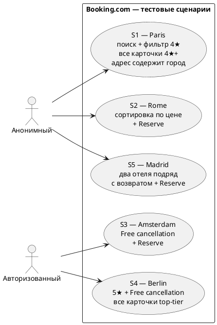

# Use Cases — Booking.com Functional Testing

**Вариант 331602** | Сайт: https://www.booking.com

---

## Акторы

| Актор | Описание | Как достигается в тестах |
|---|---|---|
| **Анонимный пользователь** | Без авторизации, без сохранённых данных. | По умолчанию: если в корне нет `storage-state.json`. |
| **Аутентифицированный пользователь** | Активная сессия booking.com. | `./gradlew saveAuth` создаёт `storage-state.json`. Тест автоматически подгружает его в `BrowserContext`. |

---

## Use Cases (атомарные действия пользователя)

| UC | Название | Актор | Описание |
|---|---|---|---|
| UC-01 | Открыть главную | Любой | Загрузить `booking.com`, закрыть оверлеи (cookie consent, sign-in popup). |
| UC-02 | Ввести город | Любой | Заполнить input `name="ss"`, выбрать подсказку из автокомплита. |
| UC-03 | Выбрать даты | Любой | Открыть календарь, кликнуть check-in и check-out по `data-date`. |
| UC-04 | Запустить поиск | Любой | Submit формы → переход на `/searchresults.html`. |
| UC-05 | Просмотреть карточки | Любой | Список `[data-testid='property-card']` отрендерен. |
| UC-06 | Применить фильтр звёзд | Любой | Чекбокс `input[name='class=N']`. |
| UC-07 | Применить фильтр Free cancellation | Любой | Чекбокс `input[name='fc=2']`. |
| UC-08 | Применить сортировку | Любой | Дропдаун `[data-testid='sorters-dropdown-trigger']` → `button[role='option']`. |
| UC-09 | Открыть карточку отеля | Любой | Клик `a[data-testid='title-link']` → `/hotel/...`. |
| UC-10 | Прочитать данные отеля | Любой | `<h1>` (название), `[data-testid='PropertyHeaderAddressDesktop-wrapper']` (адрес), `[data-testid='date-display-field-start']` (виджет дат). |
| UC-11 | Просмотреть номера | Любой | Прокрутить к `#availability_target`, увидеть `[data-testid='select-room-trigger']`. |
| UC-12 | Инициировать бронирование | Любой | Выбрать qty=1 в первом select, нажать `[data-testid='reservation-summary']//button[type=submit]`. |

---

## Группировка UC по комбинациям → 5 сценариев

| | без сортировки | сортировка по цене |
|---|---|---|
| **без фильтра** | S5 (анон, листает, открывает 2 отеля, бронирует второй) | S2 (анон) |
| **фильтр звёзд** | S1 (анон) | — |
| **фильтр Free cancel** | S3 (auth) | — |
| **фильтр звёзд + Free cancel** | S4 (auth) | — |

---

## Use Case диаграмма



---

## Сценарии — детально

### S1 — Анонимный поиск четырёхзвёздочного отеля в Париже

**Тест:** `BookingE2ETest.searchWithStarFilterThenOpenHotelAndCheckAvailability`
**Покрывает:** UC-01..06, UC-09..11
**Актор:** анонимный пользователь
**Город:** Paris

1. Открыть `booking.com`, закрыть cookie/genius оверлеи.
2. Ввести «Paris» в поле города, выбрать подсказку из автокомплита.
3. Выбрать даты заезда (+30 дней) и выезда (+37 дней).
4. Нажать «Search».
5. На странице результатов применить фильтр `class=4` (4 звезды).
6. **✓ Проверка:** у КАЖДОЙ карточки рейтинг ≥ 4★.
7. Запомнить заголовок первой карточки и кликнуть по ней — открывается новая вкладка.
8. **✓ Проверка:** `<h1>` отеля содержит слово из заголовка карточки.
9. **✓ Проверка:** адрес отеля содержит «Paris» (вход. ↔ итог.).
10. **✓ Проверка:** виджет даты показывает выбранный месяц или день заезда.
11. Прокрутить к секции «Availability».
12. **✓ Проверка:** доступен ≥ 1 типа номеров.

---

### S2 — Анонимный поиск самого дешёвого отеля в Риме и попытка бронирования

**Тест:** `BookingE2ETest.searchWithPriceSortThenOpenHotelAndClickReserve`
**Покрывает:** UC-01..05, UC-08..12
**Актор:** анонимный пользователь
**Город:** Rome

1. Открыть `booking.com`, закрыть оверлеи.
2. Ввести «Rome», выбрать подсказку, выбрать даты, нажать Search.
3. Открыть дропдаун сортировки, кликнуть пункт «Price (lowest first)».
4. Извлечь цены ВСЕХ карточек.
5. **✓ Проверка:** для каждой пары соседних карточек `prices[i-1] ≤ prices[i]` — список идёт по возрастанию.
6. Запомнить заголовок первой карточки, открыть её — новая вкладка.
7. **✓ Проверка:** название на странице совпадает с карточкой.
8. **✓ Проверка:** адрес содержит «Rome».
9. Прокрутить к Availability, **✓ Проверка:** доступен ≥ 1 типа номеров.
10. В первом `select-room-trigger` выбрать qty=1.
11. Нажать submit-кнопку формы бронирования (`I'll reserve`).
12. **✓ Проверка:** URL ушёл с `/hotel/` и содержит `/book`, `checkout`, `sign-in`, `register` или `/account`.

---

### S3 — Авторизованный поиск с фильтром «Free cancellation» в Амстердаме

**Тест:** `AuthenticatedBookingE2ETest.authFreeCancellationReserve`
**Покрывает:** UC-01..05, UC-07, UC-09..12
**Актор:** аутентифицированный пользователь
**Город:** Amsterdam
**Требует:** `storage-state.json` в корне (создаётся командой `./gradlew saveAuth`).

1. Проверить что `storage-state.json` подгружен (флаг `authenticated == true`). Если нет — тест пропускается с сообщением «запустите ./gradlew saveAuth».
2. Открыть `booking.com`, закрыть оверлеи.
3. Ввести «Amsterdam», выбрать подсказку, даты, Search.
4. На странице результатов кликнуть чекбокс `fc=2` (Free cancellation).
5. Запомнить заголовок первой карточки, открыть её.
6. **✓ Проверка:** название на странице совпадает с карточкой.
7. **✓ Проверка:** адрес содержит «Amsterdam».
8. **✓ Проверка:** доступен ≥ 1 типа номеров.
9. В первом ряду номеров выбрать qty=1, нажать submit формы.
10. **✓ Проверка:** URL ушёл с `/hotel/` на форму бронирования.

---

### S4 — Авторизованный поиск премиум-отеля в Берлине с двойным фильтром

**Тест:** `AuthenticatedBookingE2ETest.authCombinedFiltersAllCardsMatch`
**Покрывает:** UC-01..07, UC-09..10
**Актор:** аутентифицированный пользователь
**Город:** Berlin
**Требует:** `storage-state.json`.

1. Проверить `storage-state.json` подгружен.
2. Открыть `booking.com`, ввести «Berlin», выбрать подсказку, даты, Search.
3. Кликнуть чекбокс `class=5` (5★).
4. Кликнуть чекбокс `fc=2` (Free cancellation). Booking применяет фильтры аддитивно.
5. **✓ Проверка:** у КАЖДОЙ карточки рейтинг ≥ 5. Учитывается, что booking даёт смесь: «5★» отелей и «10/10» self-rated апартаментов — обе категории top-tier.
6. Запомнить заголовок первой карточки, открыть её.
7. **✓ Проверка:** название на странице совпадает с карточкой.
8. **✓ Проверка:** адрес содержит «Berlin».

---

### S5 — Анонимный пользователь полистал, передумал, забронировал другой

**Тест:** `BookingE2ETest.browseTwoHotelsThenReserveSecond`
**Покрывает:** UC-01..05, UC-09..12 (открытие двух разных отелей)
**Актор:** анонимный пользователь
**Город:** Madrid

1. Открыть `booking.com`, ввести «Madrid», выбрать подсказку, даты, Search.
2. **✓ Проверка:** в выдаче ≥ 2 карточек.
3. Запомнить заголовки 1-й и 2-й карточек.
4. **✓ Проверка:** заголовки разные (иначе тест пропускается — нерепрезентативно).
5. Кликнуть title-link 1-й карточки — открывается новая вкладка с отелем #0.
6. Прочитать `<h1>` отеля #0, сохранить как `name0`.
7. «Передумал»: вызвать `closeExtraTabs()` — закрывает все вкладки кроме `/searchresults`.
8. Кликнуть title-link 2-й карточки — открывается новая вкладка с отелем #1.
9. Прочитать `<h1>` отеля #1, сохранить как `name1`.
10. **✓ Проверка:** `name0 ≠ name1` (действительно открыли разные отели).
11. Прокрутить к Availability, **✓ Проверка:** доступен ≥ 1 типа номеров.
12. В первом ряду выбрать qty=1, нажать submit формы.
13. **✓ Проверка:** URL ушёл с `/hotel/` и содержит `/book`, `checkout`, `sign-in`, `register` или `/account`.

---

## Чек-лист

- [x] Главная страница открывается, оверлеи закрываются
- [x] Поиск принимает город, даты
- [x] Кнопка «Search» переводит на /searchresults или /city/
- [x] Карточки результатов рендерятся (`property-card`)
- [x] Фильтр по звёздам применяется (`input[name='class=N']`)
- [x] Фильтр Free cancellation применяется (`input[name='fc=2']`)
- [x] Сортировка по цене даёт средние первой половины ≤ второй
- [x] Клик по карточке открывает страницу отеля (новая вкладка ИЛИ SPA)
- [x] **Адрес отеля содержит введённый пользователем город** (главное замечание препода)
- [x] Виджет бронирования показывает дату заезда
- [x] Секция Availability содержит хотя бы один Reserve
- [x] Reserve уводит с /hotel/ на форму бронирования / sign-in
- [x] Каждая карточка после фильтра 4★ имеет ≥4★
- [x] Каждая карточка после комбинированного фильтра 5★+FC имеет ≥5★
- [x] Можно открыть одну карточку, вернуться к выдаче и открыть другую — это разные отели
- [x] Сценарии запускаются в Chrome И Firefox
- [x] Селекторы — XPath по `data-testid`
- [x] **Никаких `Thread.sleep`** — `page.waitForTimeout` (Playwright API) для rate-limit, `waitFor` для ожидания элементов
- [x] Page Object pattern (BasePage, MainPage, SearchResultsPage, HotelDetailsPage, BookingPage)

---

## Параллельность

| Уровень | Механизм | Где |
|---|---|---|
| **Браузеры** | `@ParameterizedTest @MethodSource("browsers")` — Chrome и Firefox как отдельные JUnit-инвокации | Все E2E-классы |
| **Gradle-задачи** | `./gradlew testChrome testFirefox --parallel` — Gradle запускает задачи в параллельных JVM | `build.gradle` |
| **JUnit 5** | `parallel.enabled=true` (фреймворк готов), методы и классы по умолчанию `same_thread` (booking.com банит параллельные сессии в одной JVM) | `junit-platform.properties` |

---

## XPath селекторы

Все селекторы проверены через Playwright-MCP против живого DOM (2026-05-07).

| Назначение | XPath |
|---|---|
| Поле города | `//div[@data-testid='destination-container']//input[@name='ss']` |
| Подсказка автокомплита | `//div[@data-testid='destination-container']//li[@data-testid='autocomplete-result' and contains(., '%s')]` |
| Кнопка дат | `//button[@data-testid='searchbox-dates-container']` |
| Календарь | `//div[@data-testid='searchbox-datepicker-calendar']` |
| Ячейка дня | `[data-testid='searchbox-datepicker-calendar'] [data-date='YYYY-MM-DD']` |
| «Следующий месяц» | `//button[@aria-label='Next month']` |
| Кнопка «Поиск» | `//div[@data-testid='searchbox-layout-wide']//button[@type='submit']` |
| Карточка | `//div[@data-testid='property-card']` |
| Заголовок карточки | `//div[@data-testid='property-card']//div[@data-testid='title']` |
| Ссылка карточки | `//div[@data-testid='property-card']//a[@data-testid='title-link']` |
| Цена карточки | `//div[@data-testid='property-card']//*[@data-testid='price-and-discounted-price']` |
| Звёзды карточки | `//div[@data-testid='property-card']//div[@data-testid='rating-stars']` |
| Адрес карточки | `//div[@data-testid='property-card']//*[@data-testid='address' or @data-testid='address-link']` |
| Review score карточки | `//div[@data-testid='property-card']//*[@data-testid='review-score']` |
| Фильтр N звёзд | `//input[@type='checkbox' and @name='class=N']` |
| Фильтр Free cancellation | `//input[@type='checkbox' and @name='fc=2']` |
| Триггер сортировки | `//button[@data-testid='sorters-dropdown-trigger']` |
| Пункт сортировки | `//div[@data-testid='sorters-dropdown']//button[@role='option' and normalize-space(.)='%s']` |
| Заголовок отеля | `//h1` |
| Адрес отеля | `//*[@data-testid='PropertyHeaderAddressDesktop-wrapper']` |
| Виджет даты | `//*[@data-testid='date-display-field-start']` |
| Якорь Availability | `//*[@id='availability_target']` |
| Селект кол-ва номеров | `//select[@data-testid='select-room-trigger']` |
| Кнопка Reserve (submit) | `//*[@data-testid='reservation-summary']//button[@type='submit']` |

---

## Запуск

```bash
# Анонимные сценарии S1, S2, S5
./gradlew testChrome --tests "ru.itmo.tpo.BookingE2ETest"

# Аутентифицированные S3, S4
./gradlew saveAuth                        # один раз: войти руками, сохранить куки
./gradlew testChrome --tests "ru.itmo.tpo.AuthenticatedBookingE2ETest"

# Всё разом, в Chrome
./gradlew testChrome

# Chrome + Firefox параллельно (2 JVM)
./gradlew testChrome testFirefox --parallel

# Один сценарий
./gradlew testChrome --tests "ru.itmo.tpo.BookingE2ETest.searchResultsAllInRequestedCity"

# Отчёт
xdg-open build/reports/tests/chrome/index.html
```

---

## Структура

```
src/test/java/ru/itmo/tpo/
├── BookingE2ETest.java              ← S1, S2, S5 (анонимный)
├── AuthenticatedBookingE2ETest.java ← S3, S4 (с сессией)
├── SaveAuthState.java               ← ./gradlew saveAuth → storage-state.json
├── BaseTest.java                    ← initBrowser, performSearch, throttle, skipUnless
├── TestConfig.java                  ← config из test-config.properties
├── SupportedBrowser.java
└── pages/
    ├── BasePage.java                ← navigate (45с + 1 retry), xpath helpers
    ├── MainPage.java                ← open, enterDestination, selectDate, submitSearch
    ├── SearchResultsPage.java       ← filterByStars, filterByFreeCancellation, sortBy, openHotelDetails, getAll*
    ├── HotelDetailsPage.java        ← getHotelName, getAddress, getAvailableRoomTypeCount, clickFirstReserveButton
    └── BookingPage.java             ← isLoaded (URL-проверка)

src/test/resources/
├── test-config.properties           ← города, даты, step.delay.ms
└── junit-platform.properties        ← JUnit 5 параллельность
```
